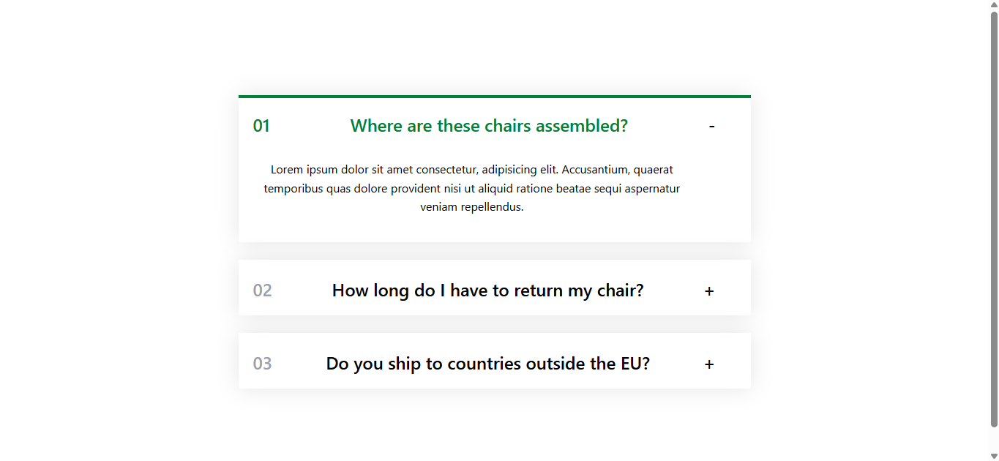

# Accordion Component

A modern, interactive accordion component built with React and TypeScript. Expand and collapse FAQ items with smooth animations and a clean user interface.

## Features

- ✨ Interactive expand/collapse functionality
- 🎨 Modern UI with Tailwind CSS styling
- 📱 Responsive design
- ♿ Semantic HTML structure
- 🧪 Fully tested with Vitest and React Testing Library
- 🎯 TypeScript support for type safety

## Screenshot



_Screenshot showing the accordion component with one FAQ item expanded and displaying content_

## Tools and Technologies

### Frontend Framework

- **React** - UI library for building interactive components
- **TypeScript** - Typed JavaScript for better code quality

### Styling

- **Tailwind CSS** - Utility-first CSS framework for rapid UI development

### Build Tools

- **Vite** - Next-generation frontend build tool with HMR
- **Vitest** - Unit testing framework compatible with Vite

### Testing

- **Vitest** - Fast unit test framework
- **React Testing Library** - Testing utilities for React components
- **@testing-library/jest-dom** - Custom matchers for DOM assertions

### Development

- **ESLint** - JavaScript/TypeScript linter
- **Tailwind CSS with Vite** - Optimized Tailwind integration

## Installation

```bash
npm install
```

## Development

Start the development server:

```bash
npm run dev
```

## Testing

Run tests:

```bash
npm run test
```

Run tests in watch mode:

```bash
npm run test:watch
```

Open test UI:

```bash
npm run test:ui
```

## Build

Build for production:

```bash
npm run build
```

Preview production build:

```bash
npm run preview
```

## Project Structure

```
src/
├── App.tsx           # Main App component with FAQ data
├── App.css           # Component styles using Tailwind CSS
├── App.test.tsx      # App component tests
├── index.css         # Global styles with Tailwind
├── main.tsx          # Application entry point
├── setup.ts          # Test setup file
├── components/
│   └── Accordion.test.tsx  # Accordion component tests
└── assets/           # Static assets
```

## Component Usage

```tsx
import App from "./App";

// The App component contains an Accordion with FAQ data
function MyApp() {
  return <App />;
}

export default MyApp;
```

## Features

### Accordion Component

- Displays a list of FAQs with title and expandable content
- Click any item to expand/collapse
- Visual feedback with green highlight for open items
- Number indicator for each FAQ item
- Plus/minus icon to indicate expand/collapse state

## Styling

The component uses Tailwind CSS utility classes for styling:

- Custom shadow for depth
- Green theme color (#087f5b)
- Responsive grid layout
- Smooth transitions on state changes

## Scripts

| Script               | Description              |
| -------------------- | ------------------------ |
| `npm run dev`        | Start development server |
| `npm run build`      | Build for production     |
| `npm run test`       | Run tests                |
| `npm run test:watch` | Run tests in watch mode  |
| `npm run test:ui`    | Open Vitest UI           |
| `npm run lint`       | Run ESLint               |
| `npm run preview`    | Preview production build |
